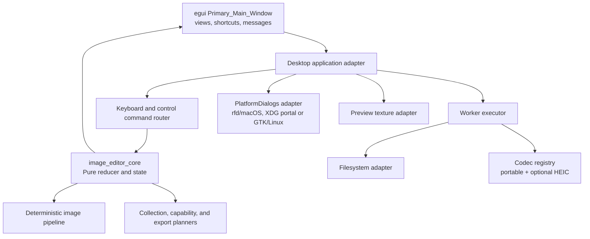
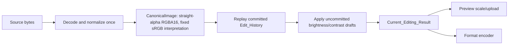

# Technical Design: macOS Image Editor

## Overview

Image Editor will be a native Rust desktop application for macOS and Linux. It will use a single shared Rust domain layer for collection discovery, commands, edit-history semantics, image transformation, capability projection, and export planning. Platform-specific code is restricted to the window/event host, native folder/save dialogs, runtime capability probes, file identities, and distributable package assembly. This preserves equivalent editing results across supported platforms while allowing each platform to report and disable unavailable integrations instead of failing to start.

**Selected approach.** The application will use `eframe` + `egui` with its native `wgpu` renderer for the one focused desktop workspace. `eframe` is selected because it supplies a Rust-native application host for macOS and Linux, while `egui` enables a compact keyboard-first workspace without a JavaScript runtime. The UI is deliberately an adapter over a pure core state machine; it does not own editing decisions. Native dialogs will be accessed through an internal `PlatformDialogs` adapter backed by `rfd`, which supports macOS and Linux native dialog backends, including XDG Desktop Portal and GTK choices on Linux. Portable JPEG, PNG, and TIFF processing will use `image-rs`; HEIC will be an optional `libheif-rs` adapter. `libheif-rs` and its libheif codec dependencies are optional so their absence is observable capability loss, not an application-start failure.

This approach satisfies the Rust/shared-behavior constraint and avoids selecting an OS-specific image framework. It also keeps the initial UI efficient: pixel processing runs off the UI thread; GPU upload happens only for a newly rendered preview revision; the immediate-mode UI redraws controls while rendering work is pending.

### Research findings

- [`eframe` documentation](https://docs.rs/eframe/latest/eframe/) describes native application hosting and selectable native renderers; the design uses its native host plus `wgpu`.
- [`rfd` documentation](https://docs.rs/rfd/latest/rfd/) documents macOS support and Linux GTK/XDG Portal backends. Its Linux runtime dependencies justify explicit availability detection and degraded mode.
- [`image` documentation](https://docs.rs/image/latest/image/) documents Rust-native image decode/encode APIs and typed image buffers, suitable for the portable codec adapter.
- [`libheif-rs` documentation](https://docs.rs/libheif-rs/latest/libheif_rs/) documents the libheif wrapper, optional image integration, and Linux libheif dependency. It supports the optional HEIC adapter strategy.

Content in this research summary was rephrased for compliance with licensing restrictions.

### Scope and non-goals

- The design supports JPEG, PNG, TIFF, and, when detected, HEIC; it does not silently claim HEIC support because an extension exists.
- Editing is non-destructive during the open session. Export creates a new file and never overwrites a source or an existing target.
- One process owns exactly one `Primary_Main_Window`. Separate multi-window editing, recursive folder scans, cloud storage, metadata editing, and persistence of edit sessions across application restarts are outside this feature.
- The initial renderer supports a scaled display texture and source-pixel crop overlay. It does not make display coordinates authoritative for crop geometry.

## Architecture

### Layered architecture



The workspace will be organized as these Rust crates/modules; each dependency version is pinned to an exact vetted version in `Cargo.toml` and locked in `Cargo.lock` at implementation time.

| Unit | Responsibility | Platform dependence |
|---|---|---|
| `image_editor_core` | Domain models, pure command reducer, edit history, collection ordering/filtering, crop validation, capability projection, deterministic transforms, export request planning | None |
| `image_editor_codecs` | `CodecRegistry`, safe image resource limits, portable `image-rs` codecs, optional HEIC adapter | HEIC runtime library/codec plugins only |
| `image_editor_platform` | `PlatformDialogs`, platform detection, file identity, package/runtime probe implementations | macOS/Linux |
| `image_editor_desktop` | eframe startup, egui views, key-event intake, task orchestration, preview texture cache | Native window/graphics APIs through eframe |

`image_editor_core` must never import `egui`, `eframe`, `rfd`, OS APIs, or asynchronous runtime types. Its operations accept values and return a new state plus declarative effects, which makes the command and rendering behavior testable without a display server or installed codec.

### State ownership and effect flow

1. Startup constructs the codec and platform adapters, probes capabilities, and creates `CapabilitySnapshot` before enabling open-folder or export commands.
2. The desktop adapter creates exactly one primary window and hands the immutable snapshot to the pure core.
3. A button or normalized keyboard event becomes one `EditorCommand`. The core validates it synchronously, changes only domain state that it owns, and optionally emits an effect such as `ChooseFolder`, `DecodeCandidate`, or `WriteExport`.
4. The adapter executes effects on the correct boundary: dialogs on the UI/main thread; file enumeration, decoding, replay, encoding, and disk writes on a bounded worker executor.
5. Each effect includes a monotonically increasing request/revision token. Completion is applied only if its token still matches the relevant pending request and document revision; stale work cannot replace a newer active image or preview.
6. Success is committed atomically through a core completion command. Failure becomes a visible `ApplicationError` and preserves the state specified by the requirements.

The core uses a reducer style rather than mutating UI callbacks directly. This is the mechanism that ensures a failed decode, unavailable feature, boundary navigation, or invalid crop cannot partially update `Browsing_State`.

### Startup and capability lifecycle

`CapabilityDetector::detect()` returns a complete `CapabilitySnapshot` before the command router accepts `OpenFolder` or `Export`:

```text
CapabilitySnapshot {
  formats: BTreeMap<ImageFormat, FormatCapability>,
  folder_picker: PlatformCapability,
  save_picker: PlatformCapability,
  diagnostics: Vec<AvailabilityMessage>,
}
```

`FormatCapability` contains independent `decode` and `encode` availability, the provider (`portable-rust` or `libheif`), and a human-readable unavailable reason. `PlatformCapability` contains `available`, backend identity, and a reason where unavailable. This representation prevents the common error of treating an extension or a compiled feature as proof that both decode and encode work.

Portable JPEG, PNG, and TIFF availability is determined from the compiled codec registry and an in-process decode/encode self-check using fixed fixture bytes and a bounded sink. HEIC is available only when the optional HEIC adapter is linked **and** its runtime `libheif` initialization reports the required decoder/encoder for the operation. Decode and encode are recorded independently. The application must not load or require HEIC merely to open JPEG, PNG, or TIFF.

On macOS, the dialog capability probe verifies that the native adapter has been constructed. On Linux, it verifies the selected rfd backend can be used: first the XDG Portal D-Bus service and a portal implementation, or the intentionally packaged GTK backend and required libraries. A failed probe creates a disabled dependent operation and a non-blocking availability message; it does not prevent the primary window from opening. The actual dialog invocation still reports a normal application error if the service disappears after probing.

## Components and Interfaces

### Domain state and command reducer

```rust
pub struct EditorState {
    pub capabilities: CapabilitySnapshot,
    pub browsing: BrowsingState,
    pub mode: InteractionMode,
    pub pending: BTreeMap<RequestId, PendingRequest>,
    pub notices: Vec<VisibleNotice>,
}

pub struct BrowsingState {
    pub source_folder: Option<AbsolutePath>,
    pub collection: ImageCollection,
    pub active: Option<ImageId>,
    pub documents: BTreeMap<ImageId, ImageDocument>,
    pub preview: PreviewState,
}

pub struct ImageDocument {
    pub source: SourceImage,
    pub history: Vec<EditOperation>,
    pub redo: Vec<EditOperation>,
    pub draft: DraftAdjustments,
    pub revision: Revision,
}

pub enum EditOperation {
    FlipHorizontal,
    FlipVertical,
    RotateClockwise90,
    RotateCounterclockwise90,
    Crop(CropRect),
    Brightness(i16),
    Contrast(i16),
}
```

`ImageCollection` stores only supported, directly contained regular files. It is ordered by the UTF-8 byte sequence of the complete filename and, for equal filenames, the UTF-8 byte sequence of the complete local path. Discovery takes an injected directory listing so ordering can be tested independently of the operating system. Directories, descendant files, and files whose extension is not one of the defined candidate extensions are never collection entries. HEIC candidates whose decoder capability is false remain visible as availability notices rather than selectable collection entries, as required.

`ImageId` is a stable source identity for this open session, composed of the absolute path plus platform file identity metadata where available. It keeps individual history and redo stacks separate even when two files have identical names. Every generated filename/path used for the requirement-defined ordering must be UTF-8; a filename that cannot be represented is reported as an availability/error notice and is not incorrectly sorted by a lossy replacement representation.

The reducer exposes the following interface:

```rust
pub fn reduce(state: &EditorState, command: EditorCommand) -> Reduction;

pub struct Reduction {
    pub state: EditorState,
    pub effects: Vec<Effect>,
}
```

`Reduction` either retains the relevant prior state or produces a complete validated new state. Effects have no authority to mutate state; their typed completions (`FolderEnumerated`, `ImageDecoded`, `PreviewRendered`, `ExportWritten`, `OperationFailed`) re-enter the reducer. This separation makes the required retain-prior-state behavior explicit.

### UI workspace

`DesktopApp` renders the only primary window as a three-region layout:

- **Collection pane:** open-folder control, supported-image file-name entries, selected-image indicator, unavailable-format availability messages, and folder enumeration errors.
- **Preview pane:** source-name title including extension, empty-collection/no-active messages, decoded preview, pending-progress indicator, crop overlay, and error banner. The crop overlay converts pointer positions to source pixel coordinates only through the current render transform; all persisted values are source-pixel integers.
- **Command pane:** visible controls and platform-correct shortcut labels for flip, rotation, crop entry/confirm/cancel, adjustment focus/increase/decrease/commit, undo, redo, and export. Availability projection disables any command whose required capability is absent and explains why.

The renderer receives an already-computed `ViewModel` from the core. Controls emit the same `EditorCommand` types as keys, so there is one command path. A control is enabled only when `CapabilitySnapshot`, active-image state, crop mode, and history state allow its command. When an active image exists, all required applicable controls are simultaneously present in the one window.

### Keyboard abstraction

The desktop adapter normalizes eframe/winit key events into `RawKeyEvent { key, modifiers, pressed, repeat }`. `ShortcutResolver` maps it to an `EditorCommand` using the runtime platform:

| Intent | macOS input/label | Linux input/label |
|---|---|---|
| Undo / redo | `Command+Z` / `Command+Shift+Z` | `Control+Z` / `Control+Shift+Z` |
| Adjustment increase / decrease | `Option+Up` / `Option+Down` | `Alt+Up` / `Alt+Down` |
| Navigation | Left, Right, Home, End | Left, Right, Home, End |
| Edit actions | F, Shift+F, R, Shift+R, C, B, D, Return | F, Shift+F, R, Shift+R, C, B, D, Return |

The resolver is a pure table indexed by `RuntimePlatform`, physical/logical key identity, and modifier set. It accepts exactly one command for one non-repeat press event and ignores release, auto-repeat, and events already consumed by an active text-capable control. No UI widget independently executes a shortcut, preventing duplicate processing. The platform-specific table changes modifier recognition and labels only; both tables emit the same semantic command.

### Image codec and processing interfaces

```rust
pub trait ImageCodec: Send + Sync {
    fn capability(&self, format: ImageFormat) -> FormatCapability;
    fn decode(&self, path: &AbsolutePath, limits: DecodeLimits)
        -> Result<DecodedSource, CodecError>;
    fn encode(&self, image: &CanonicalImage, format: ImageFormat,
              destination: &mut dyn Write) -> Result<(), CodecError>;
}

pub trait PlatformDialogs: Send + Sync {
    fn folder_picker_available(&self) -> PlatformCapability;
    fn save_picker_available(&self) -> PlatformCapability;
    fn pick_folder(&self) -> Result<Option<AbsolutePath>, PlatformError>;
    fn pick_export_target(&self, formats: &[ImageFormat])
        -> Result<Option<ExportTarget>, PlatformError>;
}

pub trait FileSystem: Send + Sync {
    fn enumerate_direct_files(&self, folder: &AbsolutePath)
        -> Result<Vec<DirectoryEntry>, FileError>;
    fn identity(&self, path: &AbsolutePath) -> Result<FileIdentity, FileError>;
    fn create_new(&self, path: &AbsolutePath) -> Result<NewFile, FileError>;
}
```

`image_editor_codecs` registers the portable codecs unconditionally when compiled with their pinned features. `OptionalHeicCodec` is registered only after runtime probe success. The registry selects by the requested available format, not by filename extension alone. File-content decode errors are distinct from unavailable capabilities, so a malformed supported PNG reports a decode `ApplicationError` rather than misleadingly disabling PNG.

### Shared image-processing pipeline



`CanonicalImage` is an owned, deterministic, straight-alpha `RGBA16` raster with explicit width and height. The decoder normalizes every supported source to this representation and applies source-orientation normalization once before it becomes the base image. The pipeline uses integer arithmetic and specified rounding, never platform floating-point image APIs:

- Horizontal flip maps `(x, y)` to `(W - 1 - x, y)`.
- Vertical flip maps `(x, y)` to `(x, H - 1 - y)`.
- Clockwise rotation maps `(x, y)` to `(H - 1 - y, x)` with dimensions `(H, W)`.
- Counterclockwise rotation maps `(x, y)` to `(y, W - 1 - x)` with dimensions `(H, W)`.
- Crop validates a half-open `CropRect { left, top, right, bottom }` against the dimensions of the image produced by prior committed operations, then copies exactly that source-coordinate rectangle.
- Brightness and contrast accept only `-100..=100`. Brightness adds a signed fixed-point fraction of the full 16-bit range to each RGB sample and clamps; contrast scales the distance from the 16-bit midpoint by `(100 + value) / 100`, rounds with a documented ties-to-nearest rule, and clamps. Alpha is unchanged. A value of zero is an identity transformation.

The exact arithmetic functions live only in `image_editor_core`. `image-rs` is used for decode/encode and buffer conversion, never for a platform-dependent edit operation. This is the critical cross-platform equivalence boundary.

Rendering is lazy and revision-keyed. The worker replays the source plus committed history and drafts into a `CurrentEditingResult`. A cache keyed by `(ImageId, history_revision, draft_values)` may retain intermediate images, but cached and uncached execution must call the same operation implementations. A thumbnail/preview may be downscaled after the full-resolution result has been produced; export always encodes the full-resolution result.

### Crop and adjustment interaction

`InteractionMode` is `Browse`, `Crop(CropDraft)`, or `Adjust(FocusedAdjustment)`. Crop entry requires an active image and creates a draft constrained to integer source pixels. The UI may show the initial selection and pointer handles in screen space, but it converts through `PreviewTransform` and clamps to `[0, W] × [0, H]` before creating `CropDraft`. Confirming a valid non-empty draft appends exactly one `Crop` operation, clears only that document's redo history, exits crop mode, and requests a preview. Invalid confirmation leaves the crop draft, history, and preview unchanged and creates an error. Cancel discards the draft without touching history or preview.

Each `ImageDocument` retains brightness and contrast draft values plus its focused field. `B`/`D` changes focus without committing. Increase/decrease changes only the focused value by exactly one inside the closed range; at either endpoint it is an explicit no-op that still leaves the current preview visible. The current preview includes committed history followed by the two non-zero drafts in fixed order (brightness, then contrast). `Return` appends exactly one operation for the focused value, including zero, resets that focused value to zero, clears only that document's redo history, and rebuilds the preview from the committed result plus any remaining draft. This realizes the required visible, uncommitted adjustment behavior without destructively altering the source.

### Navigation and decoding

`NavigationPlanner` is a pure function that returns `NoTarget`, `Candidate(ImageId)`, or `NoActiveImage` for Left, Right, Home, and End. It uses the defined collection ordering and never wraps. The adapter must decode a candidate before sending `NavigationDecodeSucceeded`. Only that completion updates `active` and preview. Decode failure retains the old active image, histories, preview, and collection, and emits an error containing the candidate filename. Empty-collection navigation retains state and presents the required empty preview message; navigation with a nonempty collection but no active image also retains state.

Folder enumeration follows the same two-phase pattern. The previous `BrowsingState` remains live until enumeration succeeds. A successful result atomically installs the source folder and new ordered collection, clears stale active/document state, and shows each supported file name. Selecting an entry likewise decodes before activation.

### Non-destructive history and export

For each `ImageDocument`, `history` and `redo` are stacks ordered by application time. Applying a new operation appends it and clears **only** the active document's redo stack. Undo pops the history tail and pushes that operation to redo; redo pops redo and pushes to history. Empty stacks are no-ops. Documents associated with other collection entries are never modified by an active document's command.

Export is a planned, guarded transaction:

1. `Export` is enabled only with an active image, save-picker capability, and at least one encoder capability. The dialog receives only `Available_Export_Format` choices.
2. The user selects one format and path. The core validates that the format is currently encodable and constructs `ExportPlan` containing the active document's immutable source identity, history/draft revision, desired path, and format.
3. The filesystem adapter resolves file identities for source and target where target exists. If the target identifies the source or another existing local regular file, it rejects the plan before opening a writer and preserves all bytes/state.
4. The render worker computes the exact `Current_Editing_Result` for the plan revision. The writer opens the target with exclusive `create_new`, encodes to a sibling temporary/new destination according to the filesystem adapter, flushes, then atomically publishes only if publication cannot replace an existing file. A collision/race is a failure, never permission to overwrite.
5. On any failure, the source, history, redo, and displayed preview remain unchanged; a path-specific error is displayed. On success, exactly one new export file exists and the source byte sequence remains unchanged.

PNG and TIFF encode the canonical result without changing width, height, or RGBA samples. JPEG and HEIC use the selected encoder and retain orientation-normalized dimensions and crop result; their sample differences may be lossy as defined by the requirements. Reopening an export always uses the normal decoder and therefore verifies the appropriate output equivalence in integration tests.

## Data Models

```rust
pub enum ImageFormat { Jpeg, Png, Tiff, Heic }

pub struct FormatCapability {
    pub decode: Availability,
    pub encode: Availability,
    pub provider: Option<CodecProvider>,
}

pub enum Availability {
    Available,
    Unavailable { reason: AvailabilityReason },
}

pub struct ImageCollection {
    pub entries: Vec<CollectionEntry>, // sorted and immutable until next folder success
    pub unavailable: Vec<UnavailableImage>,
}

pub struct CollectionEntry {
    pub id: ImageId,
    pub absolute_path: AbsolutePath,
    pub file_name: Utf8FileName,
    pub format: ImageFormat,
}

pub struct CropRect {
    pub left: u32,
    pub top: u32,
    pub right: u32,
    pub bottom: u32,
}

pub struct DraftAdjustments {
    pub brightness: i16, // invariant: -100..=100
    pub contrast: i16,   // invariant: -100..=100
    pub focused: Option<AdjustmentKind>,
}

pub struct CanonicalImage {
    pub width: u32,
    pub height: u32,
    pub pixels: Vec<Rgba16>, // exactly width * height, row-major
    pub color_space: CanonicalColorSpace, // sRGB
    pub orientation: NormalizedOrientation,
}
```

Core constructors keep the following invariants:

- A `CropRect` is valid iff `left < right ≤ width` and `top < bottom ≤ height`; its bounds use half-open source-pixel coordinates.
- A `CanonicalImage` has nonzero dimensions, an overflow-checked `width * height` count, and exactly one pixel per coordinate.
- `history`, `redo`, and drafts belong to exactly one `ImageId`; `ImageId` does not depend on its display filename.
- `CurrentEditingResult` is a pure value derived from immutable base pixels, ordered history, and current drafts. It never aliases writable source-file memory.
- Capability availability is explicit for every decode/encode and dialog operation. No missing capability is represented by a panic, absent enum variant, or implicit fallback.
- `VisibleNotice` has a severity (`Availability`, `Error`, `Info`), stable subject (filename/path/capability), and user-safe message. It never exposes stack traces or untrusted raw file content.

Resource limits are part of `DecodeLimits`: maximum input bytes, dimensions, total pixels, and intermediate allocation. Exceeding them is a decode failure with no browsing-state update. Every multiplication/addition used for buffer dimensions is checked before allocation.

## Correctness Properties

A correctness invariant is a characteristic or behavior that should hold true across all valid executions of a system—essentially, a formal statement about what the system should do. Correctness invariants serve as the bridge between human-readable specifications and machine-verifiable correctness guarantees.

PBT applies to the shared pure core: ordered collections, command reduction, integer image transforms, crop validation, adjustment arithmetic, history transitions, keyboard translation, capability projection, and in-memory lossless codec contracts. It does **not** apply to native window layout, portal/GTK availability, OS dialogs, package metadata, or physical filesystem writes; those need focused example, smoke, and integration tests.

The following properties are the non-redundant result of property reflection. For example, geometric transform properties include dimension and pixel-placement checks together, and history properties include both LIFO movement and redo invalidation rather than splitting implied assertions into separate properties.

### Property 1: Capability-filtered collection is complete and ordered

For any directory listing with valid UTF-8 direct regular files and any capability snapshot, collection planning shall include every and only decodable JPEG, PNG, TIFF, or HEIC candidate, exclude descendants/directories and undecodable candidates, and order included entries by complete filename UTF-8 bytes then full-path UTF-8 bytes.

**Validates: Requirements 1.2, 1.4, 9.3, 9.4**

### Property 2: Candidate activation is atomic

For any prior browsing state and any selection or navigation candidate, a successful decode shall set exactly that candidate as active and render its preview, while any decode error shall leave the source folder, collection, active image, histories, redo stacks, and preview equal to the prior state and produce an error naming the candidate.

**Validates: Requirements 1.5, 1.6, 1.7, 2.1, 2.2, 2.3, 2.4, 2.5, 2.6, 2.7, 2.8, 2.9**

### Property 3: Navigation targets obey collection order and boundaries

For any ordered nonempty collection and active index, Left, Right, Home, and End shall select respectively the preceding, following, first, or last valid target when one exists; at a boundary they shall produce no target and retain state. For any empty collection or missing active image, those commands shall retain the prior state.

**Validates: Requirements 2.10, 2.11, 2.12, 2.13**

### Property 4: Geometric operations preserve their specified pixel mapping

For any nonempty canonical image and every valid source coordinate, horizontal flip, vertical flip, clockwise rotation, and counterclockwise rotation shall place that source pixel at the required destination coordinate and dimensions; applying clockwise rotation four times shall yield an image equal in dimensions and every pixel location to the original.

**Validates: Requirements 3.1, 3.2, 3.3, 3.4, 3.5**

### Property 5: Crop is bounded, exact, and transactional

For any canonical image and candidate crop bounds, valid integer nonempty in-bounds bounds shall append one crop operation whose rendered result consists exactly of the corresponding half-open source rectangle; all invalid bounds shall leave crop mode, crop draft, history, and preview unchanged; cancelling any crop draft shall leave history and preview unchanged while exiting crop mode.

**Validates: Requirements 4.3, 4.4, 4.5, 4.6, 4.7**

### Property 6: Adjustment commands are clamped and commit exactly their draft

For any active document, focused adjustment kind, and valid sequence of increase/decrease commands, each command shall change the value by one only while within `[-100, 100]`, clamp at the endpoints, and render identity contribution at zero. For any focused value in the range, commit shall append exactly one matching brightness/contrast operation, reset only that focused draft to zero, and preserve the resulting committed pixels.

**Validates: Requirements 5.1, 5.2, 5.3, 5.4, 5.5, 5.6, 5.7, 5.8, 5.9, 5.10, 5.11**

### Property 7: Per-image history is reversible and branch-safe

For any image document and sequence of edit operations, undo followed by redo shall restore the exact prior ordered history and rendered result; undo/redo on an empty respective stack shall be a no-op; and adding a new operation after undo shall clear only that document's redo history without modifying another document's histories.

**Validates: Requirements 6.1, 6.2, 6.3, 6.4, 6.5, 6.6**

### Property 8: Shortcut resolution has platform-invariant semantics

For any defined non-repeat keyboard intent, the macOS and Linux shortcut tables shall resolve their respective modifier forms to the same semantic browsing, edit, history, or adjustment command; each single accepted raw press shall produce exactly one command and release/repeat events shall produce none.

**Validates: Requirements 8.3, 8.5, 8.6, 10.3, 10.4**

### Property 9: Capability projection is conservative and format-specific

For any combination of independent decode, encode, folder-picker, and save-picker availability, the view/export projection shall expose a selectable image, export choice, or enabled dependent operation if and only if its specific required capability is available; unavailable capabilities shall have a notice and shall not prevent unrelated portable format operations.

**Validates: Requirements 7.1, 8.1, 9.1, 9.2, 9.3, 9.4, 9.5, 9.6, 9.7, 9.8, 11.2, 11.3**

### Property 10: Shared pipeline is platform-equivalent

For any conformance image and any valid ordered sequence of shared edit operations and draft adjustments, evaluating the platform-independent Rust pipeline through macOS and Linux command tables shall produce equal dimensions, normalized orientation, crop bounds, and RGBA samples. For any such result, lossless PNG and TIFF encode/decode through the same supported codec contract shall preserve those dimensions and samples.

**Validates: Requirements 7.7, 10.1, 10.2, 10.5**

### Property 11: Export planning never permits replacement

For any active source identity and requested destination identity, export planning shall reject a target that identifies the source or any pre-existing regular file and shall otherwise create a plan that preserves the immutable source identity and result revision.

**Validates: Requirements 7.2, 7.3, 7.4, 7.5, 7.6**

## Error Handling

### Error model

```rust
pub enum ApplicationError {
    FolderEnumeration { folder: AbsolutePath, cause: SafeError },
    Decode { file_name: Utf8FileName, cause: SafeError },
    MissingActiveImage { command: CommandName },
    InvalidCrop { reason: CropValidationError },
    ExportTargetConflict { path: AbsolutePath, kind: TargetConflict },
    ExportWrite { path: AbsolutePath, cause: SafeError },
    PlatformOperation { capability: CapabilityName, cause: SafeError },
    ResourceLimit { subject: Utf8FileName, limit: ResourceLimitKind },
}
```

Errors are values returned through reducer completions, not panics. `SafeError` carries a user-facing summary and structured diagnostic category; detailed OS/codec diagnostics are available only in local debug logs. Errors are shown non-modally in the relevant workspace area and do not open a second primary window.

| Condition | UI behavior | State preservation |
|---|---|---|
| Folder enumeration failure | Error names selected folder | Retain prior `BrowsingState` |
| Selection/navigation decode failure | Error names candidate filename | Retain prior active image, histories, redo, preview, and collection |
| No active image for edit/adjust/crop | Error names attempted command | Retain collection, all histories/redo, and preview; do not queue command |
| Invalid crop confirmation | Show validation reason near crop controls | Retain crop mode/draft/history/preview |
| Missing dialog, HEIC decoder/encoder, or other optional dependency | Availability message and disabled dependent controls | Window and unrelated controls stay usable |
| Existing/source export path or create-new race | Error names target path | Do not open/replace target; preserve source and editor state |
| Encode/write failure | Error names target path | Preserve source, histories, redo, preview; best-effort remove only a file newly created by this failed attempt |
| Worker panic/unexpected failure | Contain at worker boundary, show generic error, record diagnostic | Retain last committed state and remain responsive |

### Degraded mode

Capability detection produces degraded mode rather than a binary supported/unsupported application state. The primary window always starts on macOS/Linux even if every optional runtime dependency is absent. Examples:

- With HEIC unavailable, `.heic` direct files are identified in the image-list area with a decoding-unavailable message; JPEG/PNG/TIFF browsing/editing/export remains available.
- With a save dialog unavailable, export is disabled with a platform-capability message; open-folder and editing remain usable.
- With folder selection unavailable, open-folder is disabled; the workspace still displays a clear availability message and does not crash.
- With a specific encoder unavailable, it is absent from export choices. JPEG/PNG/TIFF export never depends on HEIC capability.

The app does not auto-install packages, prompt the user to install dependencies during a session, or fall back to destructive behavior. Availability state is immutable for a session except that a failed actual dialog invocation can downgrade the corresponding capability and disable its dependent operation for the remainder of the session.

## Testing Strategy

### Test layers

| Layer | Scope | Tools/approach |
|---|---|---|
| Core unit tests | Exact mappings, representative state transitions, error messages, resource limits | Rust `cargo test` |
| Property tests | The 11 properties above against pure core/adapters | `proptest`, at least 100 cases/property |
| Codec integration tests | Real fixture decode/encode, malformed files, PNG/TIFF equivalence, JPEG/HEIC tolerance | Temp directories and fixed fixtures; optional HEIC suite gated by detected capability |
| Desktop integration tests | One-window startup, visible controls, keyboard routing once, crop overlay coordinate conversion | eframe test harness / accessibility tree where supported |
| Platform integration tests | rfd folder/save dialogs, actual filesystem identity/no-overwrite behavior, capability probe changes | macOS and Linux CI runners; use manual/guarded tests where portal interaction cannot be automated |
| Packaging smoke tests | Install/start package, capability message with missing optional runtime dependency | Per-target package installation image/VM |
| Visual regression tests | Workspace layout, disabled-control messaging, macOS/Linux shortcut labels | Deterministic screenshot snapshots per platform |

`proptest` is selected rather than a custom generator. Every property test runs a minimum of 100 cases and begins with a traceability comment in this exact form:

```rust
// Feature: macos-image-editor, Property 4: Geometric operations preserve their specified pixel mapping
```

Each numbered design property is implemented by one property-based test function; arbitrary generators may generate a complete operation sequence within that test. Failures retain the minimized seed/case as a regression fixture.

### Property generators and oracles

- Generate small, nonzero `CanonicalImage` values with distinct RGBA16 pixels, including asymmetric dimensions, to expose pixel-coordinate mistakes.
- Generate valid and invalid `CropRect` values independently; include zero-area, reversed, negative-at-construction, and out-of-bounds cases through an untrusted crop-input representation.
- Generate operation sequences constrained by current dimensions, plus histories and independent two-document scenarios.
- Generate filenames/paths as valid UTF-8 byte strings and directory entries with file kind/format/capability permutations. A simple reference sort is the oracle for collection order.
- Generate command streams and compare reducer history state against a compact reference stack model.
- Generate shortcut intents rather than native key events; run them through both platform key tables and compare semantic commands.
- Generate capability truth tables (decode/encode/dialog) and verify enabled controls/export formats against a small declarative requirement matrix.
- Generate conformance operation sequences once and execute the same core build/test binary in macOS and Linux CI, then compare serialized deterministic result hashes and PNG/TIFF sample data as artifacts.

### Example, edge, integration, and smoke coverage by requirement

The following testability classification covers every acceptance criterion. `P` means a property above; `E` an example/unit or UI test; `I` a real integration test; `S` a packaging/startup smoke test; `X` an explicit error/edge test. These classifications avoid attempting PBT against OS services or UI aesthetics.

| Requirement | Acceptance criteria classification and coverage |
|---|---|
| 1 | 1.1 I (native single-folder dialog configuration); 1.2 P1 + E (direct-file enumeration); 1.3 X (enumeration failure retains state); 1.4 P1 + E (entry names); 1.5–1.7 P2 + I (decode-before-activation and failure). |
| 2 | 2.1–2.9 P2/P3 + E (candidate selection/decode transaction); 2.10–2.13 P3 + E (boundary, empty, and no-active cases). |
| 3 | 3.1–3.5 P4; 3.6 X (no-active error and no deferred execution). |
| 4 | 4.1–4.2 E/X (mode entry/no-active); 4.3–4.7 P5 + E (source-coordinate overlay, valid/invalid/cancel behavior). |
| 5 | 5.1–5.11 P6 + E (focused control presentation and preview revision); 5.12 X (no-active command preservation). |
| 6 | 6.1–6.6 P7 + E (specific undo/redo examples and no-active behavior). |
| 7 | 7.1 I (single-path native save dialog and choices); 7.2–7.6 P11 + I (create-new, file identity, source byte preservation, write failures); 7.7 P10 + I (reopen actual export and compare format-appropriate output). |
| 8 | 8.1 E + visual regression (one-window control visibility); 8.2 E (complete filename); 8.3 P8 + desktop I (one command per key press); 8.4 S (exactly one window); 8.5–8.6 P8 + visual regression (platform label names). |
| 9 | 9.1 S/I (startup probes before request); 9.2 P9 + I; 9.3–9.8 P1/P9 + E/I (notices, filtering, disabled controls, portable independence). |
| 10 | 10.1–10.2 P10 + cross-platform I; 10.3–10.4 P8; 10.5 S/I (shared capabilities available on both targets). |
| 11 | 11.1 S (package manifests/dependency documentation); 11.2–11.3 P9 + S/I (degraded/available operation projection); 11.4–11.5 I (actual platform choosers). |

### CI matrix and acceptance gates

CI will run a pinned Rust toolchain on `aarch64-apple-darwin` and `x86_64-unknown-linux-gnu` (plus an additional macOS architecture build when release policy requires it). Both targets run core unit/property tests. Headless UI tests use the renderer's supported headless/screenshot configuration; native dialog tests run only on hosted runners with their required desktop/portal capability and are reported separately from pure-core tests.

Required gates before release:

1. Formatting, clippy, core unit tests, and all 11 property tests pass with at least 100 generated cases each on both platforms.
2. Cross-platform conformance fixtures produce equal deterministic pipeline artifacts on both platforms.
3. PNG/TIFF export-reopen tests verify exact width, height, and RGBA samples. JPEG/HEIC tests verify dimensions, orientation/crop semantics, and successful decode rather than exact lossy samples.
4. macOS and Linux packaging smoke tests start exactly one window with optional HEIC and dialog dependencies both present and intentionally absent.
5. Integration tests demonstrate that source files and existing target files remain byte-identical after every rejected or failed export path.

## Packaging and Distribution Considerations

The application will ship separate, target-specific installable packages that declare their platform and runtime capability providers.

- **macOS:** notarized/signed `.app`/DMG or `.pkg` containing the native Rust binary and bundled codec libraries where license-compatible. The package manifest records whether HEIC decode/encode is bundled. The native dialog adapter uses the macOS dialog backend. Bundle signing/notarization and universal-binary assembly are release-pipeline concerns, not shared-core behavior.
- **Linux:** a native package plus a portable package strategy (for example, AppImage/Flatpak) selected during release engineering. Package metadata declares the rfd backend choice. XDG Portal packages declare a portal backend/runtime as optional; GTK packages declare the corresponding shared library dependency. `libheif` and its codec plugins are explicitly identified as optional runtime dependencies when not bundled.
- **Capability manifest:** each package includes a machine-readable `capabilities.json` and human-readable release note that state target triple/platform, compiled portable codecs, optional HEIC provider expectations, and dialog backend expectations. The application does not trust this manifest as runtime truth; it still probes its environment at startup.
- **Reproducibility:** build from a locked dependency graph, record Rust toolchain and target, separate compile-time features (`portable-codecs`, `heic`, `xdg-portal`, `gtk`) from runtime availability, and generate SBOM/license data for bundled native libraries.

Packaging must never turn an optional dependency into an undisclosed startup prerequisite. If a package installs without a portal backend or HEIC codec plugin, the application still opens its one primary window and projects that fact as disabled capability-aware behavior.
